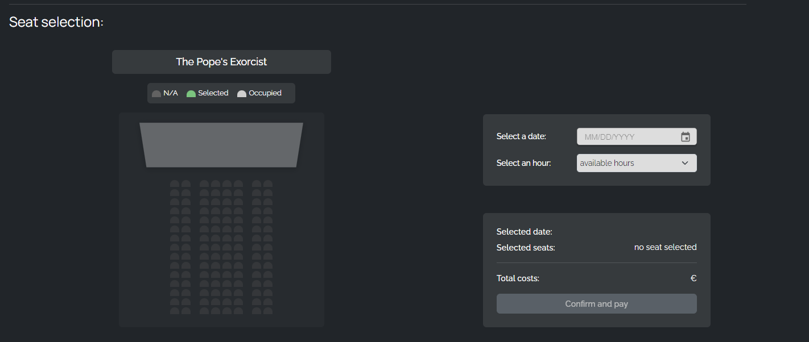
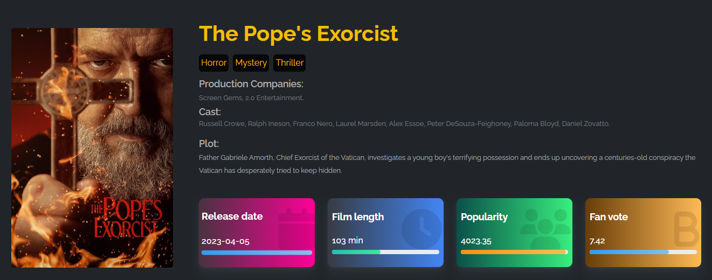

# CapstoneProject - Thynk Cinema
> This project represent my last web application built while following Epicode bootcamp for the past 6 months.
> The Capstone Project is meant to be a demonstration of the skills learned during the bootcamp and a business card for the future.
> We were given about 25 days to develop an idea, choose the desired technologies and then realize it.

> Also, this Capstone, represent for me what a huge improvements i've reached in the last few months of my life.

## Table of Contents
* [General Info](#general-information)
* [Technologies Used](#technologies-used)
* [Features](#features)
* [Screenshots](#screenshots)
* [Setup](#setup)
* [Usage](#usage)
* [Project Status](#project-status)
* [Room for Improvement](#room-for-improvement)
* [Acknowledgements](#acknowledgements)
* [Contact](#contact)
<!-- * [License](#license) -->

## General Information
- My Capstone Project intends to simulate the web application of a cinema, with the aim of selling its own products and to retain their customers.
- As explained earlier, this project intends to demonstrate the skills learned during the last 6 months of bootcamp, both front-end & back-end sides.

## Technologies Used

### Back-end

- Java SE 17 - Object-oriented programming language
- Spring Boot 3.0.6 - Java-based framework for building RESTful APIs
- PostgreSQL - Relational database management system
- JWT Authentication - JSON Web Token authentication mechanism

### Front-end

- React 18.2.0 - JavaScript library for building user interfaces
- TypeScript 4.9.5 - Typed superset of JavaScript
- React Redux 8.0.5 - Official React bindings for Redux state management
- Redux Toolkit 1.9.5 - Redux toolset for efficient development
- React Bootstrap 2.7.4 - UI framework for React applications
- React Router DOM 6.1.1 - Routing library for React applications
- Sass 1.62.1 - CSS extension language
- React YouTube 10.1.0 - React component for YouTube player integration

### Additional Technologies

- Payment Gateway API - Integration for secure payment processing
- Other libraries, frameworks, or tools you used in your project

## Features

- Browse ongoing movie projections
- Search for movies and retrieve detailed information
- Purchase cinema tickets online
- Secure payment processing

## Screenshots

## Installation

1. Clone the repository: `git clone [https://github.com/AleOnta/CapstoneProject-Epicode]`
2. Install the dependencies:
npm install
4. Set up the database and configure the connection.
5. Start the development server:
5. Open your browser and visit: `http://localhost:3000`

## Usage

- Register as a user to access ticket purchasing functionality.
- Explore the ongoing projections to choose a movie.
- Utilize the search feature to find detailed information about a specific movie.
- Select the desired movie and follow the steps to purchase tickets securely.

`write-your-code-here`

## Project Status

Project is: _in progress_ .

## Room for Improvement

Include areas you believe need improvement / could be improved. Also add TODOs for future development.

Room for improvement:
- Improvement to be done 1
- Improvement to be done 2

To do:
- Feature to be added 1
- Feature to be added 2
